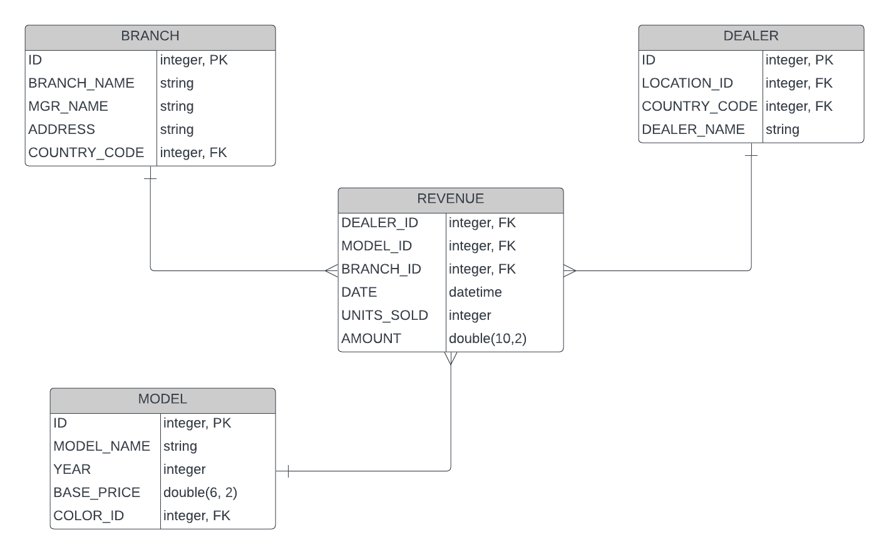
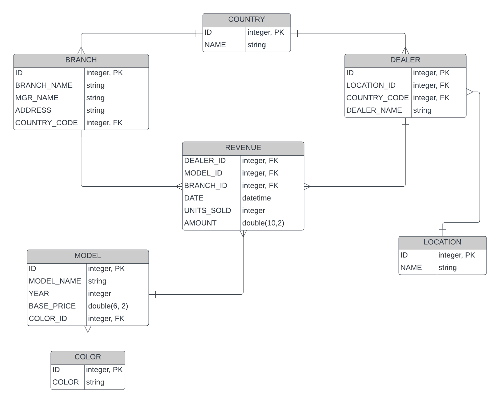

# Data Modeling

## Introduction
In this lesson, we'll read through the two most popular data modeling strategies, star schema and snowflake schema. 

## Objectives
- Learn differences between two schema
- Lean when to use each one

### What is star schema?
A star schema is a database schema used to store data in a star format when viewed from ERD (entity relationship diagram). This schema consists of a central table, called "fact table", and a number of entities, or tables, connected to the "fact table". The other tables around "fact table" are called "dimension tables". 
A dimension table stores attributes, or, dimensions, that describe the entity. For example, a car dimension table can store attributes like make, model, year produced, cost of a car, etc.
A fact table stores references to dimension tables, and more importantly, it also stores quantitative metrics, like KPIs.

### What is snowflake schema?
Just like star schema, snowflake schema is a multi-dimensional model, but you can think of snowflake schema as an expansion of star schema, where dimension tables are broken down into subdimensions. Engineers break down individual dimension tables into logical subdimensions. This can make data model more complex, but it can be easier for analysts to work with. It's called a snowflake schema because its ERD looks like a snowflake.

### Dive in with an example
We'll take a look at a simple example of star schema, then an expanded snowflake schema.
Suppose you're working as an engineer at a headquarter for a car company. You are given an ERD like below:

Let's walk through this ERD. The fact table is the `REVENUE` table in the middle. It contains aggregates of sales, and you can see the `DATE` column so you can easily imagine that you can get sales per day. The dimension tables surround the fact table, and there are 3 dimension tables, `BRANCH`, `DEALER`, and `MODEL`. Each table as `ID` column and noted `PK`, which means `ID` column is the primary column for all 3 dimension tables.  Notice `REVENUE` table does not have a primary key field, but it has `FK`. This means foreign key and these columns tell that the values in `FK` columns are primary keys in other tables.
Why does `REVENUE` table do not have a primary key field? Because `REVENUE` table concerns the aggregation of the data, and its unique row can be defined by date. The purpose of the fact table is pre-aggregated data so you can query information faster. Information that we want to tell from `REVENUE` column is, from the name, revenue.

Some questions that can be answered from `REVENUE` table are
- What was the total sale of a model with ID 20 in last month?
- Which branch is performing the best? What are top 5 highest sales branch over a year?
- On which day, did cars sold most?
- Which dealer sold most cars?
- ..and so on.

Imagine answering these questions without `REVENUE` table - you will be joining all 3 tables, every time you want to answer a question. So now it's easy to see why a business would want fact tables pre-formulated, and just do a simple `SELECT` query to pull important KPIs.

Now, let's take a look at some fields. `COUNTRY_CODE` in `BRANCH` and `DEALER` tables are coded, which means if we want to know the exact name of country, we'll have to search for another table. Same goes with `COLOR_ID` in `MODEL` table. Now, to make data more normalized, we expand this ERD into snowflake schema like below:

All foreign keys are now mapped with more granular, normalized tables, like `COLOR`, `COUNTRY`, and `LOCATION` tables. These normalized tables no longer have other foreign keys that need to be referenced. 

### Summary
We looked at how snowflake and star schema differ. Based on business needs, you could use `COLOR_NAME` instead of referring to `COLOR` table. Snowflake schema offers more storage efficiency, but due to high normalization, query performance might not be as great as star schema. On the other hand, star schema query performance can be faster due to duplicated data, but takes a toll in storage efficiency. This discussion is what you need to carry out with your team and data engineers to design data warehouse and data mart properly. 